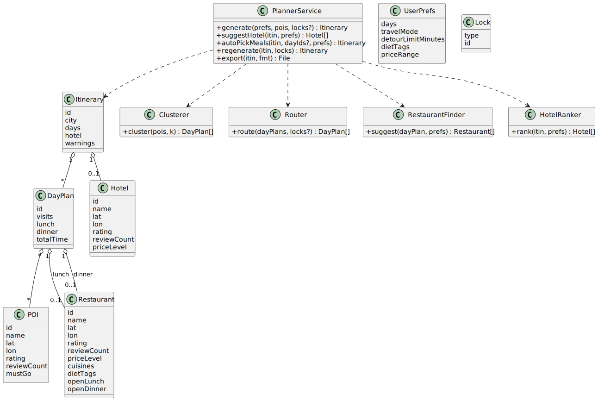
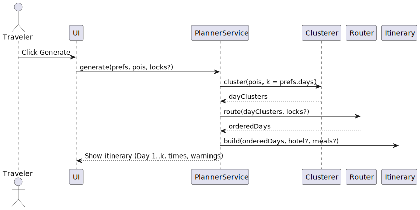
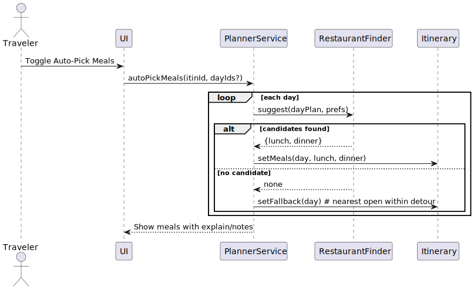
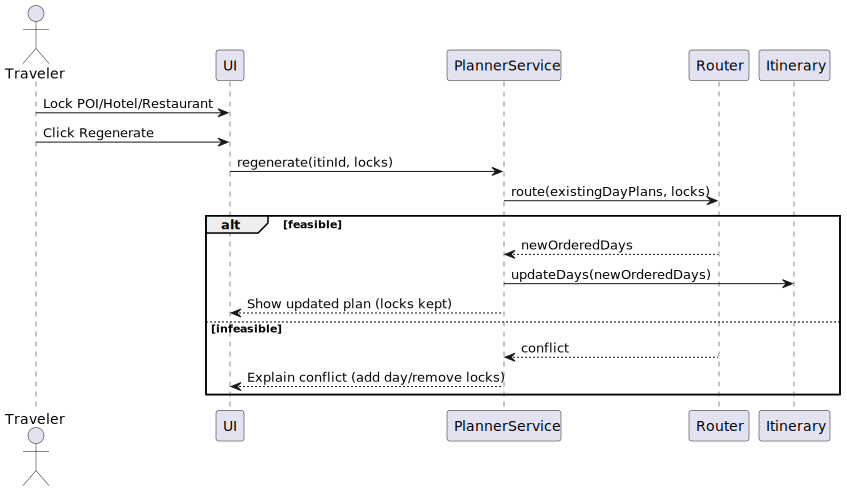

# CityRoute — Software Requirements Specification (SRS)

**First version — single city (Pittsburgh), 3–7 days, ≤ 40 POIs, fast and simple**

---

## 1. Introduction

### 1.1 Purpose
This document specifies what the **CityRoute** application will do in its first version and the constraints it must satisfy. It defines the features, data, rules, and interfaces needed to generate a short city trip plan with a convenient hotel and lunch/dinner choices.

### 1.2 Scope
CityRoute converts a user’s list of places into a **3–7 day** plan for **Pittsburgh**, groups nearby places into daily sets, orders each day to reduce travel time, and suggests a hotel and lunch/dinner. The first version is intentionally small: **≤ 40 POIs**, a **curated list** of hotels and restaurants, and **plan generation in < 10 seconds** on a typical laptop. Users can lock favorites and regenerate the plan.

### 1.3 Intended Audience
- **Instructor / reviewers:** evaluate completeness and feasibility.  
- **Future maintainers:** implement and test against these requirements.  
- **Stakeholders / users:** understand capabilities and limits.

### 1.4 Definitions, Acronyms, and Abbreviations
- **POI (Point of Interest):** a place the user wants to visit (e.g., museum, park).  
- **Day Plan:** the set and order of POIs to visit on a specific day.  
- **Detour:** extra travel time added to include a restaurant or hotel.  
- **Open Hours:** time windows when a restaurant is open (lunch/dinner).  
- **Lock:** a user-fixed choice (POI/hotel/restaurant) preserved during regeneration.  
- **Export:** download of the plan in PDF/CSV/JSON.

### 1.5 Overview
Users pick places and days, click **Generate**, and CityRoute builds a plan: cluster nearby places by day, order visits to save time, suggest a hotel near the plan, and add lunch/dinner (manual or auto-pick). Users can lock items and regenerate until satisfied.

---

## 2. Overall Description

### 2.1 Users and Goals
- **Traveler (primary user):** wants a fast, practical daily plan with a convenient hotel and reasonable lunch/dinner choices, without juggling many tabs.

### 2.2 Product Perspective
Stand-alone web app (desktop browser). Data is initially seeded from CSV/JSON files (no live traffic, no complex transit). The app can later integrate external APIs and richer data.

### 2.3 Assumptions
- City = **Pittsburgh** only (first version).  
- Trips are **3–7 days**.  
- Up to **40 POIs** per plan.  
- Curated lists for **10–15 hotels** and **30–60 restaurants**.  
- Travel times are simple walk/drive estimates (no real-time traffic).  
- Restaurant open hours are available in seed data.

### 2.4 Constraints
- Generate a complete plan in **< 10 seconds** on a typical laptop.  
- Use simple heuristics (k-means, nearest-neighbor + 2-opt).  
- No complex bus/train mixing or live traffic.  
- Privacy: no unnecessary personal data.

### 2.5 Dependencies
- Seed CSV/JSON for POIs/hotels/restaurants.  
- Modern desktop browser.  
- Local run environment (e.g., Python/Node) for the prototype.

---

## 3. System Features (Functional Requirements)

Each feature is traceable to Use Cases (UC1–UC6) defined separately.

### FR1. Add POIs and tags
- **Description:** User adds POIs via search/map; tag **must-go / nice-to-go**.  
- **Related Use Cases:** UC1  
- **Preconditions:** City selected; user provides ≥ 1 POI.  
- **Postconditions:** POIs stored in current session/plan.

### FR2. Group nearby places by day (3–7 days)
- **Description:** Given days (*k*), cluster POIs into *k* day groups.  
- **Related Use Cases:** UC1  
- **Notes:** Warn if must-go density overloads a day.

### FR3. Order visits & show times
- **Description:** Order each day’s POIs with a quick route (nearest-neighbor + 2-opt) and show time estimates.  
- **Related Use Cases:** UC1

### FR4. Suggest a hotel
- **Description:** Rank hotels by proximity to day plans (centroids), rating, and review count; user picks one.  
- **Related Use Cases:** UC2

### FR5. Restaurants — Manual
- **Description:** User filters cuisine/price/diet/open-now and picks lunch/dinner; system updates times.  
- **Related Use Cases:** UC3

### FR6. Restaurants — Auto-Pick
- **Description:** System selects lunch/dinner using open hours, detour limit, rating/price/diet, and diversity; user can swap or override.  
- **Related Use Cases:** UC4

### FR7. Lock & Regenerate
- **Description:** User locks POI/hotel/restaurant; system regenerates around locks.  
- **Related Use Cases:** UC5

### FR8. Export plan (PDF/CSV/JSON)
- **Description:** Export ordered POIs, hotel, meals, and times.  
- **Related Use Cases:** UC6

#### 3.x Trace to Use Cases
| FR  | Use Case(s) |
|----:|-------------|
| FR1 | UC1 |
| FR2 | UC1 |
| FR3 | UC1 |
| FR4 | UC2 |
| FR5 | UC3 |
| FR6 | UC4 |
| FR7 | UC5 |
| FR8 | UC6 |

---

## 4. External Interface Requirements

### 4.1 User Interface (high-level)

**Main Layout**
- **Map canvas** (center): shows POIs, day clusters (Day 1/2/3…), hotel icon, and lunch/dinner icons.
- **Side panel** (right or left):
  - **Trip**: City selector (locked to Pittsburgh), Days (3–7), Travel mode (Walk/Drive).
  - **POIs**: Search/Add POIs, list with tags (must-go / nice-to-go), delete.
  - **Hotel**: “Suggest Hotels” list (rating, distance score), pick one.
  - **Meals**: **Manual** (filters: cuisine, price, diet, open-now) or **Auto-Pick** toggle.
  - **Actions**: **Generate**, **Lock**, **Regenerate**, **Export (PDF/CSV/JSON)**.
- **Status/Warn bar** (top or bottom): success/info/warning messages.

**Common UI Elements**
- **Buttons**: Generate, Lock (toggle on item), Regenerate, Export.
- **Filters**: cuisine, price range, diet tags (veg, halal, etc.), open-now.
- **Icons**: POI pin ●, **Hotel** 🛏, **Lunch/Dinner** 🍴, **Locked** 🔒.
- **Tooltips**:
  - POI: name, rating, must-go badge.
  - Restaurant: name, rating, price, open window, detour minutes.
  - Hotel: name, rating, “avg distance to days”.
- **Messages** (examples):
  - “Must-go items exceed the time budget for Day {d}. Add a day or uncheck some POIs.”
  - “No restaurants open within the lunch window; showing the nearest feasible option.”
  - “Regenerated around your locks.”

**Accessibility**
- Legible font sizes; color + shape for cluster groups.
- Keyboard focus for action buttons; screen-reader labels on icons.

---

### 4.2 Web API (first version, minimal)

> Endpoint names may evolve; the idea is to keep them small and clear.

#### 4.2.1 POST `/itinerary/generate`
- **GET /itineraries/{itinerary_id}** → returns the itinerary (IDs only).
- **GET /days/{day_id}** → returns a DayPlan (IDs only), see DayPlan Example in §6.x.
- **Description:** Build an itinerary from inputs.
- **Request (JSON):**
```json
{
  "city": "Pittsburgh",
  "days": 3,
  "travel_mode": "drive",
  "prefs": {
    "detour_limit_minutes": 15,
    "diet_tags": ["veg"],
    "price_range": "$$"
  },
  "pois": [
    {
      "id": "poi1",
      "name": "Carnegie Museum of Art",
      "lat": 40.4431,
      "lon": -79.9496,
      "rating": 4.7,
      "review_count": 1200,
      "must_go": true
    },
    {
      "id": "poi2",
      "name": "Point State Park",
      "lat": 40.4414,
      "lon": -80.0089,
      "rating": 4.8,
      "review_count": 980,
      "must_go": false
    }
  ],
  "locks": [
    { "type": "poi", "id": "poi1" }
  ]
}
```
- **Response (JSON):**
```json
{
  "itinerary_id": "it-001",
  "day_ids": ["day1", "day2", "day3"],
  "hotel_id": "h1",
  "warnings": []
}

```
- **Errors:**
  - `400 Bad Request` — invalid days (must be 3–7), POIs > 40, invalid coordinates.
  - `422 Unprocessable Entity` — locks conflict with time budget (explain which item).

#### 4.2.2 GET `/hotels/suggest?itinerary_id={ID}`
- **Description:** Get ranked hotel suggestions for an existing itinerary.
- **Response (JSON):**
```json
{
  "hotels": [
    {
      "id": "h1",
      "name": "Downtown Hotel A",
      "lat": 40.4410, 
      "lon": -80.0020,
      "rating": 4.4,
      "review_count": 850,
      "score": 0.87,
      "price_level": "$$"
    },
    {
      "id": "h2",
      "name": "North Shore Hotel B",
      "lat": 40.4500, 
      "lon": -80.0100,      
      "rating": 4.5,
      "review_count": 920,
      "score": 0.83,
      "price_level": "$$$"
    }
  ]
}
```
- **Errors:**
  - `404 Not Found` — itinerary not found.

#### 4.2.3 POST `/restaurants/auto_pick`
- **Description:** Auto-select lunch and dinner for requested days.
- **Request (JSON):**
```json
{
  "itinerary_id": "it-001",
  "day_ids": ["day1", "day2", "day3"]
}
```
- **Response (JSON):**
```json
{
  "days": [
    { "id": "day1", "lunch_id": "r5", "dinner_id": "r8", "notes": [] },
    { "id": "day2", "lunch_id": "r2", "dinner_id": null, "notes": ["No dinner candidates within detour; showing nearest feasible."] }
  ]
}

```
- **Errors:**
  - `409 Conflict` — no open restaurant within detour/time window (include explanation + nearest fallback).

#### 4.2.4 POST `/export`
- **Description:** Export itinerary to a chosen format.
- **Request (JSON):**
```json
{ "itinerary_id": "it-001", "format": "pdf" }
```
- **Response:** File stream (PDF/CSV/JSON)
- **Errors:**
  - `400 Bad Request` — unknown format; incomplete plan if “meals required” is set.

---

### 4.3 Data File Interfaces (seed/import)

**`/data/seeds/pois.csv`**
```csv
name,lat,lon,rating,review_count,must_go
Carnegie Museum of Art,40.4431,-79.9496,4.7,1234,true
```

**`/data/seeds/hotels.csv`**
```csv
name,lat,lon,rating,review_count,price_level
Downtown Hotel A,40.4410,-80.0020,4.4,850,$$
```

**`/data/seeds/restaurants.csv`**
```csv
name,lat,lon,rating,review_count,price_level,cuisines,diet_tags,open_lunch,open_dinner
Market Square Cafe,40.4408,-80.0023,4.3,600,$,American,veg,11:30-14:00,17:30-20:30
```

---

### 4.4 Error Messages (examples)

- **Must-go overload:** “Must-go items exceed the time budget for Day {d}. Add a day or uncheck some POIs.”  
- **Closed restaurant:** “No open restaurants within the lunch window near Day {d}. Showing the nearest feasible option.”  
- **Detour too long:** “This choice adds {x} minutes, above the limit ({limit} min). Try another pick or increase the limit.”  
- **Export validation:** “Meals required is on. Add lunch/dinner for Day {d} or turn off this requirement.”

---

### 4.5 Usability & Accessibility Notes

- Minimum 14–16px body text; clear contrasts for cluster colors.  
- Keyboard focus for buttons; aria-labels for pins/hotel/meal icons.  
- Avoid color-only distinctions; use labels (Day 1/2/3) and shapes.

---

## 5. Non-Functional Requirements (Qualities)

- **NFR1 Performance:** For **≤ 40 POIs**, generate a complete plan in **< 10 seconds** on a typical laptop.  
- **NFR2 Usability:** Clear warnings (e.g., too many must-go for chosen days); one action per button; simple map UI.  
- **NFR3 Security/Privacy:** No unnecessary personal data; if sign-in is added later, protect itineraries and credentials.  
- **NFR4 Reliability:** Graceful fallbacks (e.g., closed restaurant → next best open within detour limit); meaningful error messages.  
- **NFR5 Portability:** Runs in modern desktop browsers.  
- **NFR6 Maintainability (nice-to-have):** Separate modules for clustering, routing, hotels, meals.

---
## 6. Data Model

### 6.1 Entities

- **POI**: `{ id, name, lat, lon, rating, review_count, must_go: boolean }`
- **Hotel**: `{ id, name, lat, lon, rating, review_count, price_level }`
- **Restaurant**: `{ id, name, lat, lon, rating, review_count, price_level, cuisines[], diet_tags[], open_lunch: "11:30-14:00", open_dinner: "17:30-20:30" }`
- **DayPlan**: `{ id, visit_ids: string[], lunch_id?: string, dinner_id?: string, total_time_minutes: number }`
  – `visit_ids` are POI IDs in visiting order.
  – `lunch_id` / `dinner_id` are Restaurant IDs.
- **Itinerary**: `{ id, city, day_ids: string[], hotel_id?: string, warnings: string[] }`
  – `day_ids` refer to DayPlan objects.
  – `hotel_id` is a Hotel ID.
- **UserPrefs**: `{ days: number, travel_mode: "walk"|"drive", detour_limit_minutes: number, diet_tags?: string[], price_range?: "$"|"$$"|"$$$" }`
- **Lock**: `{ type: "poi" | "hotel" | "restaurant", id: string }`

---
### 6.2 Example JSON (request + separate resource examples)

**Generate request (example)**

```json
{
  "city": "Pittsburgh",
  "prefs": {
    "days": 3,
    "travel_mode": "drive",
    "detour_limit_minutes": 15
  },
  "pois": [
    {
      "id": "poi1",
      "name": "Carnegie Museum of Art",
      "lat": 40.4431,
      "lon": -79.9496,
      "rating": 4.7,
      "review_count": 1200,
      "must_go": true
    },{
      "id": "poi2",
      "name": "Point State Park",
      "lat": 40.4414,
      "lon": -80.0089,
      "rating": 4.8,
      "review_count": 980,
      "must_go": false
    }
  ]
}
```

**Itinerary (IDs-only, separate resource)**

```json
{
  "id": "itin1",
  "city": "Pittsburgh",
  "day_ids": ["day1", "day2", "day3"],
  "hotel_id": "h1",
  "warnings": []
}
```
**DayPlan (IDs-only, separate resource)**

```json
{
  "id": "day1",
  "visit_ids": ["poi2", "poi1"],
  "lunch_id": "r5",
  "dinner_id": "r9",
  "total_time_minutes": 380
}
```

---

### 6.3 Example Payloads (responses)

**POST /itinerary/generate → Response (IDs-only)**

```json
{
  "itinerary_id": "demo-1",
  "day_ids": ["day1", "day2", "day3"],
  "hotel_id": "h1",
  "warnings": []
}
```
**GET /days/{day_id} → Response (DayPlan)**

```json
{
  "id": "day1",
  "visit_ids": ["poi1", "poi2"],
  "lunch_id": "r5",
  "dinner_id": "r8",
  "total_time_minutes": 340
}
```

> Note: The itinerary returns **IDs only** (no embedded DayPlan objects). Fetch each day’s details via **GET `/days/{day_id}`**.

---

## 7. Business Rules & Validation

- **Trip days**: integer in **[3, 7]**.
- **POI count**: total **≤ 40** for a single itinerary.
- **Coordinates**: every POI/Hotel/Restaurant must have valid numeric **lat** and **lon**.
- **Daily time budget**: **7 hours/day**; the planned route for any day must **not exceed** this budget.
- **Meal windows** (if lunch/dinner is set): restaurant must be **open** within:
  - Lunch **11:30–14:00**
  - Dinner **17:30–20:30**
- **Detour limit**: extra travel time to each meal stop **≤ 15 minutes** (**default 15**, configurable).
- **Minimum hotel rating**: **4.0** (fallback to **3.5** if fewer than 3 options remain after filters).
- **Meals required**: **OFF by default**. If “Require meals each day” is ON, export must fail with a clear message when a meal is missing.
- **Filters**: when set by the user, **diet** and **price** filters must be enforced on meal suggestions.
- **Locks**: locked POIs/hotel/restaurants must be preserved after **Regenerate**; if infeasible, the system must show a clear **conflict message** with guidance (e.g., “remove one lock or add a day”).

---

## 8. Algorithms (High-Level)

- **Day Clustering:** k-means with *k* = selected days; if must-go density overloads a day, prompt the user to extend days or uncheck items.  
- **Daily Routing:** nearest-neighbor start, then 2-opt improvement; respect locks.  
- **Hotel Scoring:** combine (− average distance to day centroids) + rating + log(review_count); allow user filters (price/rating).  
- **Restaurant Scoring (Auto-Pick):** rating + log(reviews) + preference match + open-now − detour − price penalty + diversity bonus; propose swaps.  
- **Fallbacks:** if a choice is closed or exceeds detour, pick next best; explain the reason to the user.

---

## 9. Risks & Mitigations

- **Too many must-go items** → Suggest adding a day or unchecking items; show which days exceed time budget.  
- **Closed restaurants** → Choose the next best open option within detour limit; provide a clear message.  
- **Plan generation too slow** → Reduce POI count, relax constraints (e.g., skip Auto-Pick), or simplify routes.  
- **Inaccurate coordinates/data** → Flag the offending entries and request correction.

---

## 10. Appendices

### 10.1 Glossary
See **1.4** (POI, Day Plan, Detour, Open Hours, Lock, Export).

### 10.2 Traceability (stub)
| FR  | UC  | SRS Section |
|----:|----:|-------------|
| FR1 | UC1 | 3.1 |
| FR2 | UC1 | 3.2 |
| FR3 | UC1 | 3.3 |
| FR4 | UC2 | 3.4 |
| FR5 | UC3 | 3.5 |
| FR6 | UC4 | 3.6 |
| FR7 | UC5 | 3.7 |
| FR8 | UC6 | 3.8 |

### 10.3 Change Log
- **v0.1 (today):** Initial SRS created (sections 1–10).  
- **v0.2 (TBD):** Edits after instructor feedback; add final diagrams and full traceability.

---

## File Index (for reference)
- `/docs/SRS.md` (this file)  
- `/docs/Day2_UseCases.md` (use case narratives)  
- `/docs/examples/generate_request.json`  
- `/docs/examples/itinerary_example.json`

---

## 11. UML Diagrams

### 11.1 Use Case Diagram

*This diagram reflects UC1–UC6 and FR1–FR8.*

### 11.2 Class Diagram

*This diagram shows entities and services used in FR1–FR8.*

### 11.3 Sequence Diagram — Generate Itinerary

*This sequence matches UC1 main flow (Generate Itinerary).*

### 11.4 Sequence Diagram — Auto-Pick Meals

*This sequence matches UC4 main flow (Auto-Pick).*

### 11.5 Sequence Diagram — Lock & Regenerate

*This sequence matches UC5 main flow (Lock & Regenerate).*

